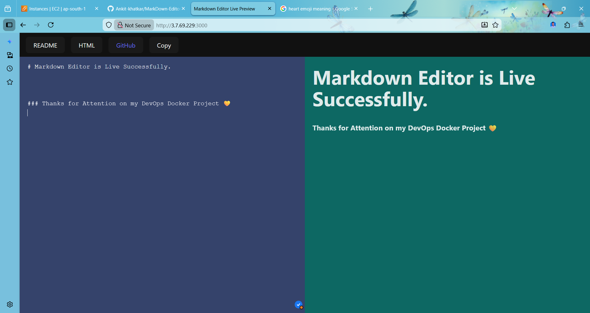

📝 Markdown Editor with Live Preview

A modern Markdown Editor with Live Preview built using React.
This application allows users to write Markdown on one side and instantly see the rendered output on the other, similar to GitHub or StackEdit.

🚀 Features

✍️ Live Markdown Editing

👀 Real-time Preview

📋 Copy Visible Preview Content

🧠 Supports:

Headings

Bold / Italic text

Lists (ordered & unordered)

Tables

Code blocks

Blockquotes

Links & Images

📐 Split-screen layout (Editor + Preview)

⚡ Built with modern React practices

🛠 Tech Stack

React

Vite

react-markdown

remark-gfm (GitHub Flavored Markdown)

CSS

📸 Preview

Left side: Markdown editor
Right side: Live rendered preview

(You can add screenshots here later for better presentation)

📂 Project Structure
src/
├── components/
│ ├── markdown.jsx
│ ├── preview.jsx
│ ├── header.jsx
│ ├── markdown.css
│ ├── preview.css
│ └── header.css
├── App.jsx
├── main.jsx
└── index.css

⚙️ Installation & Setup

Follow these steps to run the project locally:

# Clone the repository

git clone https://github.com/your-username/markdown-editor-live-preview.git

# Navigate to project folder

cd markdown-editor-live-preview

# Install dependencies

npm install

# Start development server

npm run dev

Then open:

http://localhost:5173

📋 How Copy Feature Works

Click the Copy button

Only the visible rendered preview text is copied

No markdown symbols or hidden elements are included

Uses the browser Clipboard API

🧠 Key Learnings

This project helped in understanding:

Controlled components in React

React state & props flow

Event handling

React lifecycle rules

Safe DOM interaction (onClick, useRef)

Markdown rendering using third-party libraries

Debugging real-world UI and layout issues

🔮 Future Improvements

🌙 Dark / Light mode

💾 Save content to LocalStorage

⌨️ Keyboard shortcuts (Ctrl+B, Ctrl+I)

📤 Export Markdown / HTML

🎨 Syntax highlighting for code blocks

🚀 Deploy on Vercel / Netlify

🤝 Contributing

Contributions, suggestions, and improvements are welcome.
Feel free to fork the repo and submit a pull request.

Project Snapshots--

.png)

📄 License

This project is open-source and available under the MIT License.

🙌 Author

Ankit
Learning by building real-world React projects 🚀
